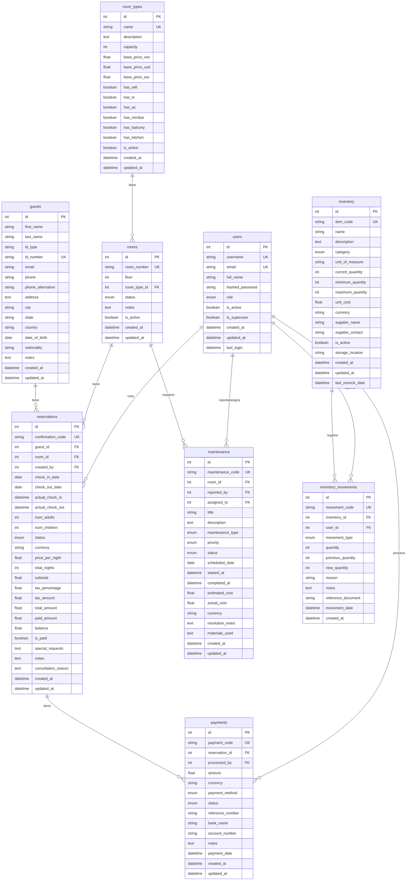

# 🗄️ Diagrama de Base de Datos - SIGHO

## Sistema Integrado de Gestión Hotelera

Este documento presenta el diagrama de entidad-relación (ER) de la base de datos del sistema SIGHO, mostrando todas las tablas, sus campos y relaciones.

---

## 📊 Diagrama de Entidad-Relación (ERD)

---

## 📋 Descripción de las Tablas

### 👤 **users** - Usuarios del Sistema
Almacena la información de los usuarios que operan el sistema.

**Roles disponibles:**
- `admin` - Administrador total
- `manager` - Gerente del hotel
- `receptionist` - Recepcionista
- `maintenance` - Personal de mantenimiento
- `inventory` - Encargado de inventario
- `viewer` - Solo visualización

---

### 🏨 **room_types** - Tipos de Habitación
Define los diferentes tipos de habitaciones disponibles en el hotel.

**Ejemplos:** Individual, Doble, Suite, Suite Presidencial

**Características configurables:**
- WiFi, TV, Aire Acondicionado, Minibar, Balcón, Cocina

---

### 🚪 **rooms** - Habitaciones
Información de las habitaciones físicas del hotel.

**Estados posibles:**
- `available` - Disponible
- `occupied` - Ocupada
- `cleaning` - En limpieza
- `maintenance` - En mantenimiento
- `out_of_service` - Fuera de servicio

---

### 🧑‍🤝‍🧑 **guests** - Huéspedes
Registro de huéspedes que han hecho o tienen reservas.

**Información almacenada:**
- Datos personales y de contacto
- Documentos de identificación
- Dirección completa
- Historial de reservas

---

### 📅 **reservations** - Reservas
Gestión completa de reservas del hotel.

**Estados de reserva:**
- `pending` - Pendiente
- `confirmed` - Confirmada
- `checked_in` - Check-in realizado
- `checked_out` - Check-out realizado
- `cancelled` - Cancelada
- `no_show` - No se presentó

**Características:**
- Código de confirmación único
- Soporte multi-moneda (VES, USD, EUR)
- Cálculo automático de impuestos (IVA 16%)
- Control de pagos y balance

---

### 💰 **payments** - Pagos
Registro de todos los pagos realizados por los huéspedes.

**Métodos de pago:**
- `cash_ves` - Efectivo en bolívares
- `cash_usd` - Efectivo en dólares
- `cash_eur` - Efectivo en euros
- `transfer` - Transferencia bancaria
- `mobile_payment` - Pago móvil
- `credit_card` - Tarjeta de crédito
- `debit_card` - Tarjeta de débito
- `other` - Otro método

**Estados:**
- `pending` - Pendiente
- `completed` - Completado
- `failed` - Fallido
- `refunded` - Reembolsado

---

### 🔧 **maintenance** - Mantenimiento
Gestión de mantenimiento preventivo y correctivo.

**Tipos de mantenimiento:**
- `preventive` - Preventivo
- `corrective` - Correctivo
- `emergency` - Emergencia

**Prioridades:**
- `low` - Baja
- `medium` - Media
- `high` - Alta
- `urgent` - Urgente

**Estados:**
- `pending` - Pendiente
- `in_progress` - En progreso
- `completed` - Completado
- `cancelled` - Cancelado

---

### 📦 **inventory** - Inventario
Control de stock de productos y suministros del hotel.

**Categorías:**
- `cleaning` - Limpieza
- `maintenance` - Mantenimiento
- `bedding` - Ropa de cama
- `bathroom` - Baño
- `kitchen` - Cocina
- `electronics` - Electrónica
- `furniture` - Muebles
- `food_beverage` - Alimentos y bebidas
- `other` - Otro

**Características:**
- Sistema de alertas por stock bajo
- Control de stock mínimo y máximo
- Valorización automática del inventario
- Información de proveedores

---

### 📊 **inventory_movements** - Movimientos de Inventario
Registra todos los movimientos de entrada y salida del inventario.

**Tipos de movimiento:**
- `in` - Entrada (compra, donación)
- `out` - Salida (uso, venta)
- `adjustment` - Ajuste (corrección)
- `transfer` - Transferencia entre ubicaciones

---

## 🔗 Relaciones Principales

### Relaciones de Usuarios
- Un **usuario** puede crear múltiples **reservas**
- Un **usuario** puede reportar/asignar múltiples solicitudes de **mantenimiento**
- Un **usuario** puede procesar múltiples **pagos**
- Un **usuario** puede registrar múltiples **movimientos de inventario**

### Relaciones de Habitaciones
- Un **tipo de habitación** puede tener múltiples **habitaciones**
- Una **habitación** puede tener múltiples **reservas** (en diferentes fechas)
- Una **habitación** puede tener múltiples solicitudes de **mantenimiento**

### Relaciones de Reservas
- Un **huésped** puede tener múltiples **reservas**
- Una **reserva** puede tener múltiples **pagos**
- Una **reserva** pertenece a una **habitación**
- Una **reserva** pertenece a un **huésped**

### Relaciones de Inventario
- Un **item de inventario** puede tener múltiples **movimientos**
- Cada **movimiento** es registrado por un **usuario**

---

## 🎯 Claves y Restricciones

### Claves Primarias (PK)
Todas las tablas tienen un campo `id` autoincremental como clave primaria.

### Claves Foráneas (FK)
- `rooms.room_type_id` → `room_types.id`
- `reservations.guest_id` → `guests.id`
- `reservations.room_id` → `rooms.id`
- `reservations.created_by` → `users.id`
- `payments.reservation_id` → `reservations.id`
- `payments.processed_by` → `users.id`
- `maintenance.room_id` → `rooms.id`
- `maintenance.reported_by` → `users.id`
- `maintenance.assigned_to` → `users.id`
- `inventory_movements.inventory_id` → `inventory.id`
- `inventory_movements.user_id` → `users.id`

### Campos Únicos (UK)
- `users.username`
- `users.email`
- `room_types.name`
- `rooms.room_number`
- `guests.id_number`
- `reservations.confirmation_code`
- `payments.payment_code`
- `maintenance.maintenance_code`
- `inventory.item_code`
- `inventory_movements.movement_code`

---

## 🔍 Índices

Para optimizar las consultas, se han creado índices en:
- Campos de clave primaria (`id`)
- Campos únicos (username, email, códigos, etc.)
- Campos de búsqueda frecuente (fechas de check-in/out, estados, etc.)

---

## 📅 Auditoría

Todas las tablas incluyen campos de auditoría:
- `created_at` - Fecha de creación del registro
- `updated_at` - Fecha de última actualización

Algunas tablas tienen campos adicionales:
- `users.last_login` - Último inicio de sesión
- `inventory.last_restock_date` - Última fecha de reabastecimiento
- `payments.payment_date` - Fecha del pago
- `inventory_movements.movement_date` - Fecha del movimiento

---

## 💾 Motor de Base de Datos

**SQLite3** - Base de datos embebida
- Archivo: `backend/sigho.db`
- ORM: SQLAlchemy 2.0
- Soporte completo para transacciones ACID
- Sin necesidad de servidor de base de datos externo

---

## 🔐 Seguridad

- Las contraseñas se almacenan hasheadas con **bcrypt**
- Nunca se almacenan contraseñas en texto plano
- Control de acceso basado en roles
- Validación de datos con Pydantic

---

## 📚 Documentación Adicional

Para más información sobre el proyecto SIGHO, consulta:
- [README.md](file:///home/edgar24/Documentos/SIGHO/sigho-system/README.md) - Documentación general del proyecto
- [INSTRUCCIONES_INSTALACION.txt](file:///home/edgar24/Documentos/SIGHO/INSTRUCCIONES_INSTALACION.txt) - Guía de instalación paso a paso

---

**Última actualización:** 27 de Noviembre de 2024  
**Sistema:** SIGHO - Sistema Integrado de Gestión Hotelera  
**Equipo de Desarrollo:** Edgar Fermenio, Andrés Sosa, Lino Gouveia, Santiago Mendez, Santiago Martin
