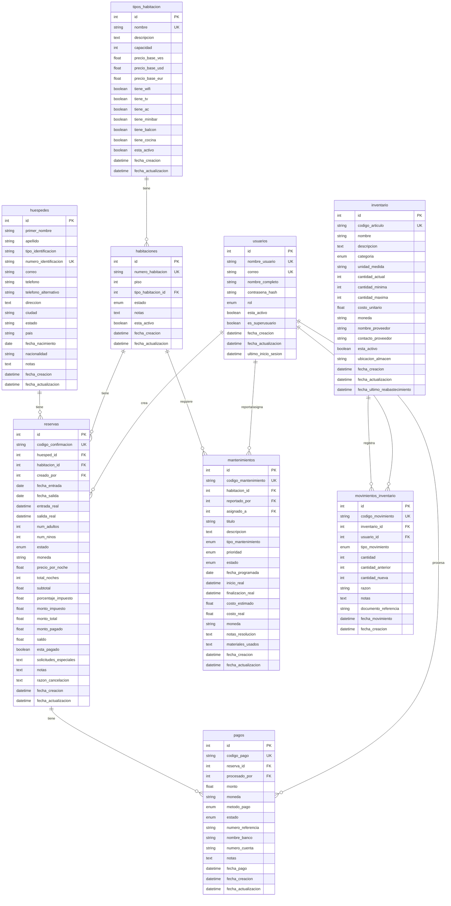

# 🗄️ Diagrama de Base de Datos - SIGHO (Versión en Español)

## Sistema Integrado de Gestión Hotelera

Este documento presenta el diagrama de entidad-relación (ER) de la base de datos del sistema SIGHO con **nombres de tablas y campos en español**, mostrando todas las tablas, sus campos y relaciones.

---

## 📊 Diagrama de Entidad-Relación (ERD) - Nombres en Español

---

## 📋 Descripción de las Tablas

### 👤 **usuarios** - Usuarios del Sistema
Almacena la información de los usuarios que operan el sistema.

**Roles disponibles:**
- `admin` - Administrador total
- `manager` - Gerente del hotel
- `receptionist` - Recepcionista
- `maintenance` - Personal de mantenimiento
- `inventory` - Encargado de inventario
- `viewer` - Solo visualización

**Campos principales:**
- `id` - Identificador único
- `nombre_usuario` - Nombre de usuario (único)
- `correo` - Correo electrónico (único)
- `nombre_completo` - Nombre completo del usuario
- `contrasena_hash` - Contraseña hasheada con bcrypt
- `rol` - Rol asignado al usuario
- `esta_activo` - Si el usuario está activo
- `es_superusuario` - Si tiene permisos de superusuario
- `ultimo_inicio_sesion` - Fecha del último acceso

---

### 🏨 **tipos_habitacion** - Tipos de Habitación
Define los diferentes tipos de habitaciones disponibles en el hotel.

**Ejemplos:** Individual, Doble, Suite, Suite Presidencial

**Campos principales:**
- `id` - Identificador único
- `nombre` - Nombre del tipo (único)
- `descripcion` - Descripción detallada
- `capacidad` - Número de personas
- `precio_base_ves` - Precio base en Bolívares
- `precio_base_usd` - Precio base en Dólares
- `precio_base_eur` - Precio base en Euros
- `tiene_wifi`, `tiene_tv`, `tiene_ac` - Características booleanas
- `tiene_minibar`, `tiene_balcon`, `tiene_cocina` - Amenidades

---

### 🚪 **habitaciones** - Habitaciones
Información de las habitaciones físicas del hotel.

**Estados posibles:**
- `available` - Disponible
- `occupied` - Ocupada
- `cleaning` - En limpieza
- `maintenance` - En mantenimiento
- `out_of_service` - Fuera de servicio

**Campos principales:**
- `id` - Identificador único
- `numero_habitacion` - Número de habitación (único)
- `piso` - Piso donde se encuentra
- `tipo_habitacion_id` - Referencia al tipo de habitación
- `estado` - Estado actual de la habitación
- `notas` - Observaciones adicionales

---

### 🧑‍🤝‍🧑 **huespedes** - Huéspedes
Registro de huéspedes que han hecho o tienen reservas.

**Campos principales:**
- `id` - Identificador único
- `primer_nombre` - Primer nombre
- `apellido` - Apellido
- `tipo_identificacion` - Tipo de documento (CI, Pasaporte, RIF)
- `numero_identificacion` - Número de documento (único)
- `correo` - Correo electrónico
- `telefono` - Teléfono principal
- `telefono_alternativo` - Teléfono secundario
- `direccion`, `ciudad`, `estado`, `pais` - Información de ubicación
- `fecha_nacimiento` - Fecha de nacimiento
- `nacionalidad` - Nacionalidad del huésped

---

### 📅 **reservas** - Reservas
Gestión completa de reservas del hotel.

**Estados de reserva:**
- `pending` - Pendiente
- `confirmed` - Confirmada
- `checked_in` - Check-in realizado
- `checked_out` - Check-out realizado
- `cancelled` - Cancelada
- `no_show` - No se presentó

**Campos principales:**
- `id` - Identificador único
- `codigo_confirmacion` - Código único de confirmación
- `huesped_id` - Referencia al huésped
- `habitacion_id` - Referencia a la habitación
- `creado_por` - Usuario que creó la reserva
- `fecha_entrada` - Fecha de check-in planificada
- `fecha_salida` - Fecha de check-out planificada
- `entrada_real` - Fecha/hora real de check-in
- `salida_real` - Fecha/hora real de check-out
- `num_adultos`, `num_ninos` - Número de huéspedes
- `moneda` - Moneda de pago (VES, USD, EUR)
- `precio_por_noche` - Precio por noche
- `total_noches` - Total de noches reservadas
- `subtotal`, `monto_impuesto`, `monto_total` - Cálculo de precios
- `monto_pagado`, `saldo` - Control de pagos
- `solicitudes_especiales` - Peticiones del huésped
- `razon_cancelacion` - Motivo si fue cancelada

---

### 💰 **pagos** - Pagos
Registro de todos los pagos realizados por los huéspedes.

**Métodos de pago:**
- `cash_ves` - Efectivo en bolívares
- `cash_usd` - Efectivo en dólares
- `cash_eur` - Efectivo en euros
- `transfer` - Transferencia bancaria
- `mobile_payment` - Pago móvil
- `credit_card` - Tarjeta de crédito
- `debit_card` - Tarjeta de débito
- `other` - Otro método

**Estados:**
- `pending` - Pendiente
- `completed` - Completado
- `failed` - Fallido
- `refunded` - Reembolsado

**Campos principales:**
- `id` - Identificador único
- `codigo_pago` - Código único del pago
- `reserva_id` - Referencia a la reserva
- `procesado_por` - Usuario que procesó el pago
- `monto` - Cantidad pagada
- `moneda` - Moneda del pago
- `metodo_pago` - Método utilizado
- `numero_referencia` - Referencia bancaria
- `nombre_banco`, `numero_cuenta` - Información bancaria
- `fecha_pago` - Fecha del pago

---

### 🔧 **mantenimientos** - Mantenimiento
Gestión de mantenimiento preventivo y correctivo.

**Tipos de mantenimiento:**
- `preventive` - Preventivo
- `corrective` - Correctivo
- `emergency` - Emergencia

**Prioridades:**
- `low` - Baja
- `medium` - Media
- `high` - Alta
- `urgent` - Urgente

**Estados:**
- `pending` - Pendiente
- `in_progress` - En progreso
- `completed` - Completado
- `cancelled` - Cancelado

**Campos principales:**
- `id` - Identificador único
- `codigo_mantenimiento` - Código único
- `habitacion_id` - Habitación que requiere mantenimiento
- `reportado_por` - Usuario que reportó
- `asignado_a` - Usuario asignado
- `titulo` - Título breve del mantenimiento
- `descripcion` - Descripción detallada
- `tipo_mantenimiento` - Tipo de mantenimiento
- `prioridad` - Nivel de prioridad
- `fecha_programada` - Fecha planeada
- `inicio_real`, `finalizacion_real` - Fechas reales
- `costo_estimado`, `costo_real` - Costos
- `notas_resolucion` - Cómo se resolvió
- `materiales_usados` - Materiales utilizados

---

### 📦 **inventario** - Inventario
Control de stock de productos y suministros del hotel.

**Categorías:**
- `cleaning` - Limpieza
- `maintenance` - Mantenimiento
- `bedding` - Ropa de cama
- `bathroom` - Baño
- `kitchen` - Cocina
- `electronics` - Electrónica
- `furniture` - Muebles
- `food_beverage` - Alimentos y bebidas
- `other` - Otro

**Campos principales:**
- `id` - Identificador único
- `codigo_articulo` - Código único del artículo
- `nombre` - Nombre del artículo
- `descripcion` - Descripción detallada
- `categoria` - Categoría del artículo
- `unidad_medida` - Unidad (pieza, caja, litro, kg, etc.)
- `cantidad_actual` - Stock actual
- `cantidad_minima` - Stock mínimo (alerta)
- `cantidad_maxima` - Stock máximo
- `costo_unitario` - Costo por unidad
- `nombre_proveedor` - Nombre del proveedor
- `contacto_proveedor` - Contacto del proveedor
- `ubicacion_almacen` - Ubicación física
- `fecha_ultimo_reabastecimiento` - Última reposición

---

### 📊 **movimientos_inventario** - Movimientos de Inventario
Registra todos los movimientos de entrada y salida del inventario.

**Tipos de movimiento:**
- `in` - Entrada (compra, donación)
- `out` - Salida (uso, venta)
- `adjustment` - Ajuste (corrección)
- `transfer` - Transferencia entre ubicaciones

**Campos principales:**
- `id` - Identificador único
- `codigo_movimiento` - Código único del movimiento
- `inventario_id` - Artículo de inventario
- `usuario_id` - Usuario que registró el movimiento
- `tipo_movimiento` - Tipo de movimiento
- `cantidad` - Cantidad movida
- `cantidad_anterior` - Stock antes del movimiento
- `cantidad_nueva` - Stock después del movimiento
- `razon` - Razón del movimiento
- `documento_referencia` - Factura, orden de compra, etc.
- `fecha_movimiento` - Fecha del movimiento

---

## 🔗 Relaciones Principales

### Relaciones de Usuarios
- Un **usuario** puede crear múltiples **reservas**
- Un **usuario** puede reportar/asignar múltiples solicitudes de **mantenimiento**
- Un **usuario** puede procesar múltiples **pagos**
- Un **usuario** puede registrar múltiples **movimientos de inventario**

### Relaciones de Habitaciones
- Un **tipo de habitación** puede tener múltiples **habitaciones**
- Una **habitación** puede tener múltiples **reservas** (en diferentes fechas)
- Una **habitación** puede tener múltiples solicitudes de **mantenimiento**

### Relaciones de Reservas
- Un **huésped** puede tener múltiples **reservas**
- Una **reserva** puede tener múltiples **pagos**
- Una **reserva** pertenece a una **habitación**
- Una **reserva** pertenece a un **huésped**

### Relaciones de Inventario
- Un **artículo de inventario** puede tener múltiples **movimientos**
- Cada **movimiento** es registrado por un **usuario**

---

## 🎯 Claves y Restricciones

### Claves Primarias (PK)
Todas las tablas tienen un campo `id` autoincremental como clave primaria.

### Claves Foráneas (FK)
- `habitaciones.tipo_habitacion_id` → `tipos_habitacion.id`
- `reservas.huesped_id` → `huespedes.id`
- `reservas.habitacion_id` → `habitaciones.id`
- `reservas.creado_por` → `usuarios.id`
- `pagos.reserva_id` → `reservas.id`
- `pagos.procesado_por` → `usuarios.id`
- `mantenimientos.habitacion_id` → `habitaciones.id`
- `mantenimientos.reportado_por` → `usuarios.id`
- `mantenimientos.asignado_a` → `usuarios.id`
- `movimientos_inventario.inventario_id` → `inventario.id`
- `movimientos_inventario.usuario_id` → `usuarios.id`

### Campos Únicos (UK)
- `usuarios.nombre_usuario`
- `usuarios.correo`
- `tipos_habitacion.nombre`
- `habitaciones.numero_habitacion`
- `huespedes.numero_identificacion`
- `reservas.codigo_confirmacion`
- `pagos.codigo_pago`
- `mantenimientos.codigo_mantenimiento`
- `inventario.codigo_articulo`
- `movimientos_inventario.codigo_movimiento`

---

## 🔄 Equivalencias con Nombres en Inglés

| Español | Inglés |
|---------|--------|
| usuarios | users |
| tipos_habitacion | room_types |
| habitaciones | rooms |
| huespedes | guests |
| reservas | reservations |
| pagos | payments |
| mantenimientos | maintenance |
| inventario | inventory |
| movimientos_inventario | inventory_movements |

---

## ℹ️ Nota Importante

Este diagrama utiliza **nombres en español** para facilitar la comprensión por parte del equipo hispanohablante. Sin embargo, en la **implementación real del código** (modelos SQLAlchemy), los nombres de tablas y campos están en **inglés** siguiendo las mejores prácticas de desarrollo.

Para ver el diagrama con los nombres tal como están implementados en el código, consulta: [DIAGRAMA_BASE_DE_DATOS.md](file:///home/edgar24/Documentos/SIGHO/DIAGRAMA_BASE_DE_DATOS.md)

---

## 📚 Documentación Adicional

Para más información sobre el proyecto SIGHO, consulta:
- [README.md](file:///home/edgar24/Documentos/SIGHO/sigho-system/README.md) - Documentación general del proyecto
- [INSTRUCCIONES_INSTALACION.txt](file:///home/edgar24/Documentos/SIGHO/INSTRUCCIONES_INSTALACION.txt) - Guía de instalación paso a paso
- [DIAGRAMA_BASE_DE_DATOS.md](file:///home/edgar24/Documentos/SIGHO/DIAGRAMA_BASE_DE_DATOS.md) - Diagrama con nombres en inglés

---

**Última actualización:** 27 de Noviembre de 2024  
**Sistema:** SIGHO - Sistema Integrado de Gestión Hotelera  
**Equipo de Desarrollo:** Edgar Fermenio, Andrés Sosa, Lino Gouveia, Santiago Mendez, Santiago Martin
